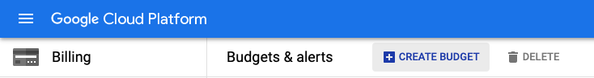
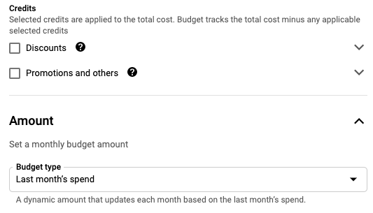
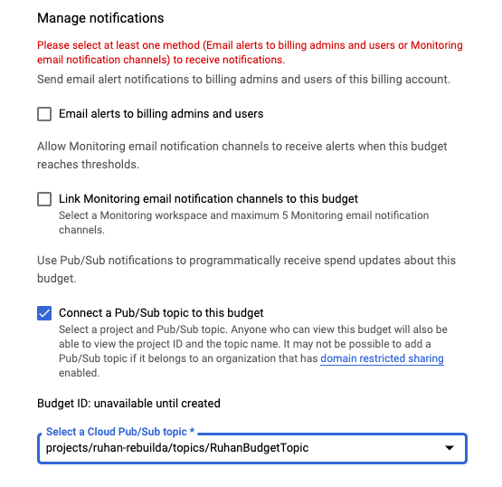
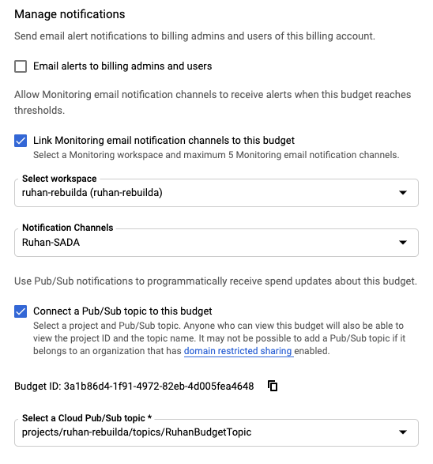
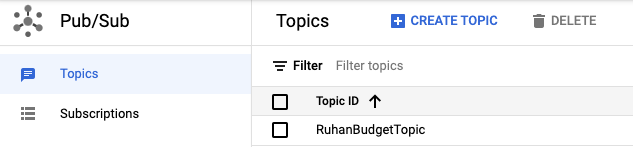

# PROACTIVE BUDGET ALERTING
This document will outline the process of configuring budget alerts to proactively monitor usage patterns and potentially identify anomalies throughout each month.

## Components
- Budgets
- Pub/Sub
- Cloud Functions
- BigQuery
- Google Chat 
> Interchangeable with most instant messaging platforms like Slack or Teams as long as it supports webhooks. 

- Monitoring workspace
> Create a workspace with specific email alerting channels to avoid sending these notifications to all billing admins or generic group email accounts.

- Cloud Build _(optional)_
> This is great for creating a CI/CD pipeline to manage future development iterations of the function(s) being deployed. Unit testing, integration testing etc.

## Configuration
1. Create a new budget alert from the GCP billing console. **Note:** You will need to create a budget for each billing account you manage.

	<p align=center>
		
		
	</p>

	> It is recommended to uncheck discounts and promotions to enable tracking of total cost. The main reasoning behind that is for predictability with regards to spending patterns.

2. Thresholds can be set according to your own requirements. A good starter formula would be to leverage 25% increments. 
> Note that the real value lies in the anomaly detection engine, which is explained in one of the next sections.


3. For notifications, choose ```Connect a Pub/Sub topic to this budget``` and in the dropdown, create a new topic. The Pub/Sub topic can also be created prior to budget creation but is not necessary. In this step, make sure you choose the project where all resources are going to be deployed (Pub/Sub, Cloud Function etc.)

	<p align=center>
		
	</p>
		
4. You'll notice that you have to choose one of the email alerting channels. To limit noise to other billing admins, I recommend [setting up a workspace](https://cloud.google.com/monitoring/workspaces) with specific email accounts.

	<p align=center>
		
	</p>

5. 	Create a new BigQuery dataset and table with the below schema.

	<p align=center>
		
	</p>

6. [Configure your Google chat](https://developers.google.com/hangouts/chat/quickstart/incoming-bot-node) for the incoming webhook

7. Once your new budget has been created, navigate to Pub/Sub on the GCP console and select the topic you created earlier. 

	<p align=center>
		
	</p>

Once selected, choose ``` "+ TRIGGER CLOUD FUNCTION" ```. Give your new function a name and choose the region where it should be deployed.
> **RECOMMENDATION**
> Choose the region that matches your project region to avoid cross-region network traffic. Pub/Sub budget notifications are triggered on average every ~30 minutes
	
Default configuration should be sufficient unless there are custom service accounts designated for triggering cloud functions. 
	
Finally, update your cloud function code to enable notifications to your IM channel of choice. Below are some examples for Slack and Google Chat.

#### extract from index.js 

**Slack**

```js
// Webhook
const fetch = require('node-fetch');

const slackURL = '<YOUR-WEBHOOK-ENDPOINT>';
const link = `<https://console.cloud.google.com/billing/${billingAccountId}|Go to Console>`;
notification = `:fire: ${link} *${budgetName}* :fire: \nYour billing account has exceeded the {threshold}%.\n>The billing account has accrued ${costAmount} in costs so far for the month.`;
            
            const slackdata = JSON.stringify({
                'text': notification,
            });

            // Post to Slack channel as per configured webhook
            fetch(slackURL, {
                method: 'POST',
                headers: {
                'Content-Type': 'application/json; charset=UTF-8',
                },
                body: slackdata,
            });
```

**Google Chat**

```js
// Google Chat Notification
const webhookURL = '<YOUR-WEBHOOK-ENDPOINT>';
    
// Construct a card notification
const data = JSON.stringify({
"cards": [
{
"header": {
    "title": `${budgetName}`,
    "subtitle": "ruhan@sada.com",
    "imageUrl": "https://storage.googleapis.com/logos/sada.png"
},
"sections": [
    {
    "widgets": [
        {
            "keyValue": {
            "topLabel": "<b>Run rate this month</b>",
            "content": `${costAmount} | Threshold: ${threshold}%`
            }
        },
        {
            "keyValue": {
            "topLabel": "<b>Spend Status</b>",
            "content": `The last cost differential was 
            <font color=\"#ff0000\">${formatter.format(diff)}</font> <br> which was higher
             than the percentile threshold of <br> ${formatter.format(perc)}`
            }
        }
    ]
    },
    {
    "widgets": [
        {
            "buttons": [
                {
                "textButton": {
                    "text": "OPEN BILLING CONSOLE",
                    "onClick": {
                    "openLink": {
                        "url": `https://console.cloud.google.com/billing/${billingAccountId}`
                    }
                    }
                }
                }
            ]
        }
    ]
    }
]
}
]
});
    
// Notification END

// Post to Google Chat as per configured webhook
            fetch(webhookURL, {
                method: 'POST',
                headers: {
                'Content-Type': 'application/json; charset=UTF-8',
                },
                body: data,
            }).then((response) => {
                console.log(response);
            });
```


## Code walkthrough
Yes, you can absolutely copy and paste the code, update the variables and be off to the races. That is the point of trying to keep things simple, however, I'd like to walk through the thought process and in particular, the anomaly detection pieces. The below section will reference extracted code from the ```index.js``` file. The complete function code can be found on sadasystems' [github](https://github.com/sadasystems/gcp-budget-alerting).

```js
const query = `SELECT count(*) cnt
                FROM \`${PROJECT}.${DATASET}.${TABLE}\`
                WHERE createdAt >  TIMESTAMP( DATE(EXTRACT(YEAR FROM CURRENT_DATE()) , EXTRACT(MONTH FROM CURRENT_DATE()), 1))
                AND threshold = ${threshold} and billingAccountId = '${billingAccountId}'
                `;
    
const options = {
    query: query,
    location: DATASET_LOCATION,
};

const [job] = await bigquery.createQueryJob(options);
    
// Wait for the query to finish
const [results] = await job.getQueryResults();
console.log('Count is: ',results[0].cnt);
```
> For each event, determine the count per threshold and billing account. This is done to ensure 
only the first event per threshold and billing account will be emitted via webhook to Slack

### Anomaly detection
The goal in this next section is to identify anomalous events within each billing account and prevent runaway spend. Let's break it down.

```js
const query3 =  `SELECT 
                    budgetName,    
                    createdAt,
                    CAST(diff AS BIGNUMERIC) AS diff,
                    ROUND(PERCENTILE_CONT(diff, 0.95) OVER(),2) AS percentile95
                FROM
                    (SELECT 
                        *,
                        costAmount - prev_costAmount as diff
                    FROM
                        (SELECT budgetName,
                                costAmount, 
                                createdAt,
                                LAG(costAmount, 1) OVER (PARTITION BY budgetName ORDER BY createdAt) AS prev_costAmount
                        FROM \`${PROJECT}.${DATASET}.${TABLE}\`
                        WHERE createdAt >  TIMESTAMP( DATE(EXTRACT(YEAR FROM CURRENT_DATE()) , EXTRACT(MONTH FROM CURRENT_DATE()), 1))
                        AND threshold = ${threshold} 
                        AND billingAccountId = '${billingAccountId}'
                        ORDER BY 1,3 DESC))
                WHERE diff > 0
                ORDER BY createdAt DESC
                LIMIT 1`;
```

> query 3 calculates two key numbers:
> 
> 1. What is the cost differential between the last and current events published to BigQuery and
> 
> 2. Where does this differential fall in terms of the overall data for the month. This is calculated by leveraging the PERCENTILE_CONT() function
> 
> **IMPORTANT** Keep in mind that there are new Pub/Sub events published every ~20 minutes for each billing account and although the thresholds set may not be triggered, it is likely that there has been a change in consumption and therefore an increase in cost. This is where the differential number comes from.

```js
const diffquery = `SELECT 
                            budgetName,
                            CAST(diff as BIGNUMERIC) as diff
                        FROM
                            (SELECT 
                                *,
                                costAmount - prev_costAmount as diff
                            FROM
                                (SELECT budgetName,
                                        costAmount, 
                                        createdAt,
                                        LAG(costAmount, 1) OVER (PARTITION BY budgetName ORDER BY createdAt) AS prev_costAmount
                                        FROM \`${PROJECT}.${DATASET}.${TABLE}\`
                                WHERE createdAt >  TIMESTAMP( DATE(EXTRACT(YEAR FROM CURRENT_DATE()) , EXTRACT(MONTH FROM CURRENT_DATE()), 1))
                                AND threshold = ${threshold}
                                AND billingAccountId = '${billingAccountId}'
                                ORDER BY 1,3 DESC))
                        LIMIT 1`
    
    const diffoptions = {
        query: diffquery,
        location: DATASET_LOCATION,
    };
    
    const [zerodiff] = await bigquery.query(diffoptions);
    console.log('Zero diff check value: ',zerodiff[0].diff);

    if (zerodiff[0].diff > 0) {
                    
        // NOTIFICATION
        // ============
        if (diff > perc) {
            console.log('99th Percentile exceeded!');            

            // Google Chat Notification
            const webhookURL = '<YOUR-WEBHOOK-ENDPOINT>';
    
            // Construct a card notification
            const data = JSON.stringify({
                        "cards": [
                            {
                            "header": {
                                "title": `${budgetName}`,
                                "subtitle": "ruhan@sada.com",
                                "imageUrl": "https://storage.googleapis.com/logos/sada.png"
                            },
                            "sections": [
                                {
                                "widgets": [
                                    {
                                        "keyValue": {
                                        "topLabel": "<b>Run rate this month</b>",
                                        "content": `${costAmount} | Threshold: ${threshold}%`
                                        }
                                    },
                                    {
                                        "keyValue": {
                                        "topLabel": "<b>Spend Status</b>",
                                        "content": `The last cost differential was <font color=\"#ff0000\">${formatter.format(diff)}</font> <br> which was higher than the percentile threshold of <br> ${formatter.format(perc)}`
                                        }
                                    }
                                ]
                                },
                                {
                                "widgets": [
                                    {
                                        "buttons": [
                                            {
                                            "textButton": {
                                                "text": "OPEN BILLING CONSOLE",
                                                "onClick": {
                                                "openLink": {
                                                    "url": `https://console.cloud.google.com/billing/${billingAccountId}`
                                                }
                                                }
                                            }
                                            }
                                        ]
                                    }
                                ]
                                }
                            ]
                            }
                        ]
                        });
            
            // Notification END

            // Post to Google Chat as per configured webhook
            fetch(webhookURL, {
                method: 'POST',
                headers: {
                'Content-Type': 'application/json; charset=UTF-8',
                },
                body: data,
            }).then((response) => {
                console.log(response);
            });

        } else console.log('Below the percentile threshold');
            
    // }); 
    } else {
        console.log('Last differential was zero');
    }
```

> Quite a few moving parts here. Let's simplify:
> 
> 1. diffquery simply calculates the cost differential between the last two events ie the last two cost amounts. 
> 
> 2. If this number is zero and the same cost amount was recorded then do nothing
> 
> 3. If the differential is > 0, compare it to the percentile value calculated earlier. This percentile is set at 95% by default but can easily be adjusted to your desired number. I would recommend getting started with the defaults and once the notifications have been consistently posted and verified for accuracy, increase the percentile to 99% to reduce noise in your Slack channel.
> 
> 	If the condition for diff > perc is true, you should be notified in Google Chat (or Slack/other IM config as per your setup). Alternatively, a message is logged to the console indicating that the diff is below the percentile threshold.


### Threshold notifications
This becomes optional given the anomaly detection piece, however it can still be useful to help keep track of spend or determine increase/decrease in ramp throughout a particular month. 

```js
if (results.length > 0 && results[0].cnt > 1 ){
    return;
}  
```
> For threshold related webhook messages, as mentioned earlier we do not want to be notified more than once per threshold and billing account within a month. The statement above evaluates whether or not this is the first entry for the month for a particular billing account and threshold. For example, it's the first of the month and the Pub/Sub event fires, creating an entry in your BigQuery dataset with X cost for threshold 0. You'll see a notification for this entry.
> 
> 20 minutes later, another event fires with Y cost but still threshold 0 for the same account. The above logic prevents another notifcation from being posted for the same threshold level. When the threshold reaches 50 for the first time, you'd expect to see a new notification.


## Resources

- [Examples of automated cost control responses](https://cloud.google.com/billing/docs/how-to/notify#listen_to_your_notifications)
- [Manage programmatic budget alert notifications](https://cloud.google.com/billing/docs/how-to/budgets-programmatic-notifications#connect-budget)
- [Github example - Slack notifications](https://github.com/momenton/gcp-billing-notifications)
- [BigQuery API client libraries](https://cloud.google.com/bigquery/docs/reference/libraries)
- [Incoming webhook with Node](https://developers.google.com/hangouts/chat/quickstart/incoming-bot-node)
- [Card Formatting Messages](https://developers.google.com/hangouts/chat/reference/message-formats/cards)
- [Git commands](https://www.atlassian.com/git/tutorials/syncing)
- [Gitops with Cloud Build](https://cloud.google.com/kubernetes-engine/docs/tutorials/gitops-cloud-build)
- [Testing event-driven functions](https://cloud.google.com/functions/docs/testing/test-event)
- [CI/CD](https://cloud.google.com/functions/docs/testing/test-cicd)
